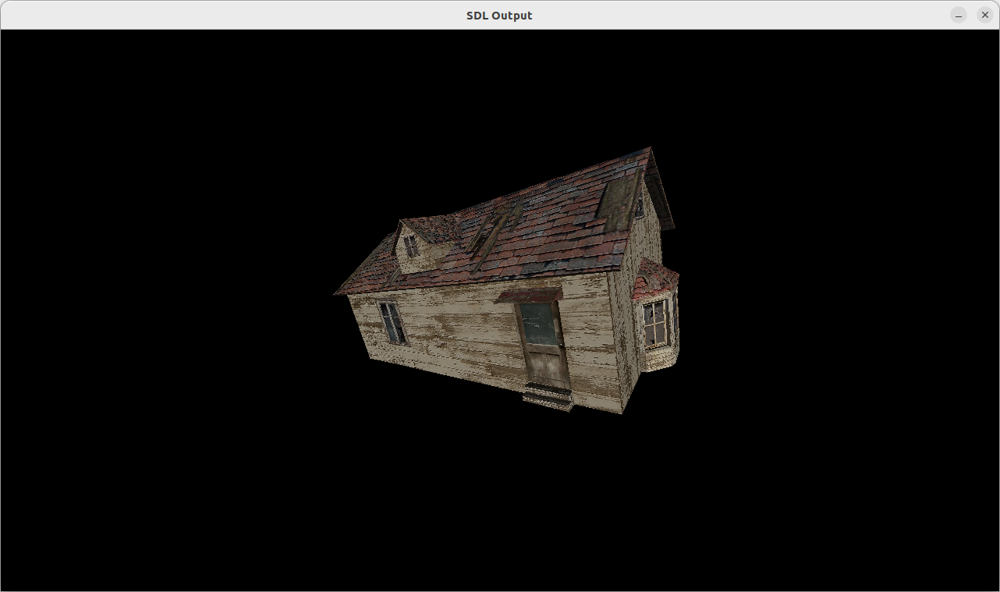

# Description
This code was done for fun to get a better appreciation of what is required to do 3D rendering.
Code quality is questionable but should be readable as example code.

## Features
Renders triangles using indexed vertices
Per-vertex normals and colors
Mouse left-button drag controls X and Y rotations
Mouse wheel controls distance to camera

## Limitations
Single mesh with a single texture
Only 'nearest neighbour' texture rendering possible
Single diffuse light coming from the camera
Triangles intersecting the camera near plane are simply discarded

# Dependencies
SDL2, SDL2_image (libsdl2-dev libsdl2-image-2.0-0 on Ubuntu 22)

# Model and texture
Model taken from
https://free3d.com/3d-model/abandoned-cottage-house-825251.html
Abandoned Cottage House by Shahid Abdullah (animatedheaven)
Model was edited (scaling issues), triangulate and exported using the Python script included.

# Importing model
I wrote a Blender script to export models as C++ code. See blender_to_cpp_exporter.py for details and instructions.

# Texture
Texture is in the model folder. Make sure it's in the working directory when launching.

# Compilation
Once you have the dependencies installed, simply use Cmake, e.g.
- cmake .
- make
- ./sw_3d_render

# Other models
Simple hand-made models are in geometry_cube.hpp and geometry_square.hpp. Change the include as required.